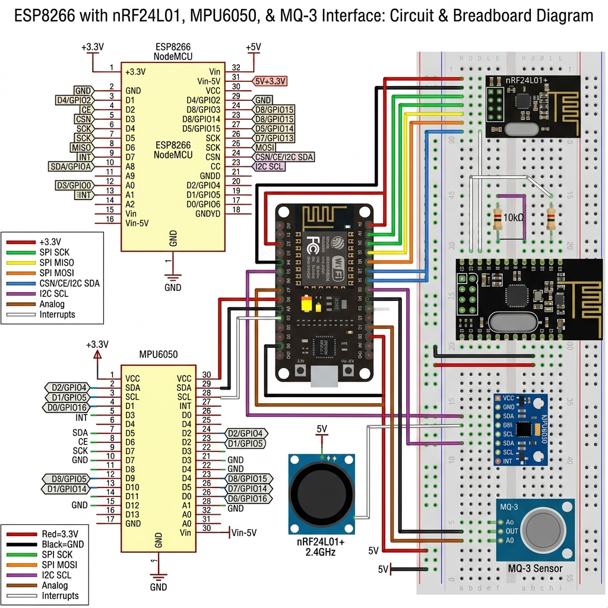
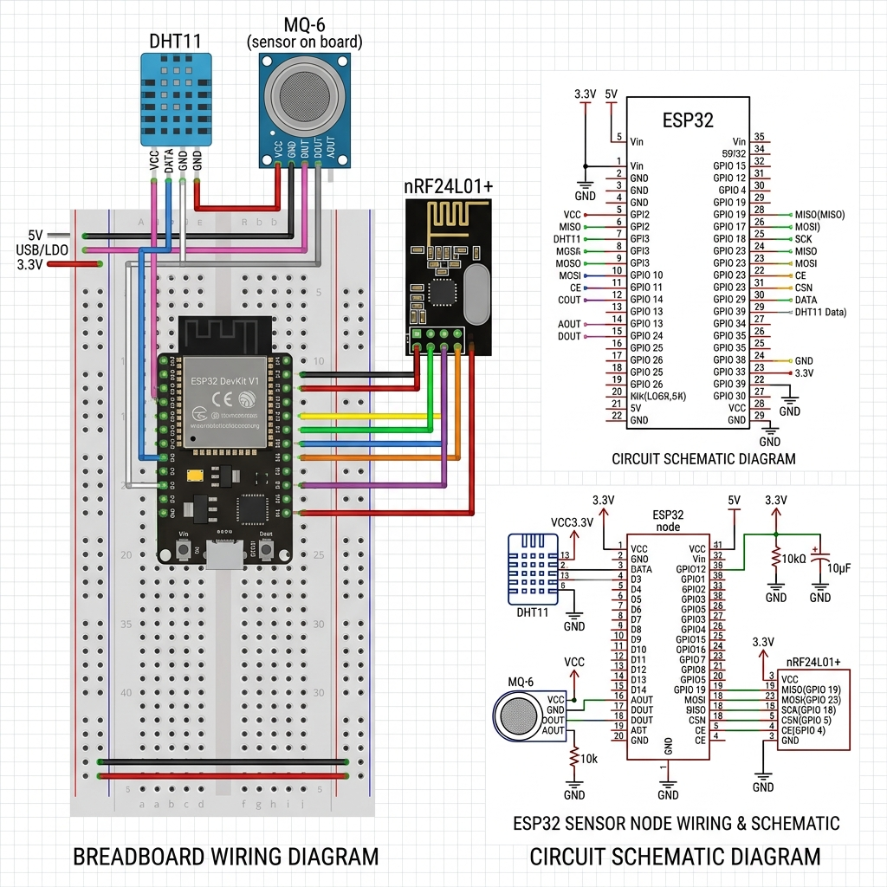

# 🚜 FarmTrace - Smart IoT Logistics & Telemetry System

**FarmTrace** is an advanced, real-time IoT and telemetry dashboard designed for monitoring agricultural logistics, secure container transport, and driver safety. Built for the Smart India Hackathon (SIH), this system ensures end-to-end visibility and data integrity.


## 🌟 Key Features

*   **Live Telemetry & Real-Time Monitoring**: Instantly monitor container conditions (Temperature, Humidity, MQ6 Gas) and driver state (MQ3 Alcohol, Vibration) via WebSockets.
*   **Dynamic Load Profiling**: Configure acceptable safety margins and thresholds for different types of cargo (e.g., Deep Frozen, Refrigerated, Sensitive).
*   **Hardware Integration**: Fully integrated with custom ESP32 IoT hardware nodes communicating over a lightweight MQTT protocol.
*   **Modern Web Dashboard**: A beautiful, highly responsive React dashboard built with Vite, Tailwind-inspired CSS, and Recharts.
*   **Alerts & Safety Tracking**: Automated anomaly detection with visual alerts when cargo conditions breach safe thresholds.
*   **Production Ready**: Configured for seamless deployment on Vercel (Frontend) and standard Node.js hosting (Backend).

---

## 🏗️ System Architecture

The project is split into three main components:

1.  **`Web_DashBoard/frontend`**: The React/Vite user interface.
2.  **`Web_DashBoard/backend`**: The Node.js/Express REST API connecting to MongoDB for historical data and load profile configurations.
3.  **`FarmTrace_MQTT_Project`**: The lightweight MQTT Broker (Aedes) and Socket.io server that bridges ESP32 hardware sensors to the web dashboard in real-time.

---

## 🚀 Getting Started (Local Development)

### Prerequisites
*   Node.js (v18+)
*   MongoDB (running locally or a MongoDB Atlas URI)
*   Git

### 1. Start the MQTT & Socket.io Server
This server handles incoming hardware telemetry from the ESP32 nodes and broadcasts it to the web dashboard.
```bash
cd FarmTrace_MQTT_Project/server
npm install
node server.js
```
*(Runs on port 3000)*

### 2. Start the Express Backend API
This server handles the database, historical logs, and load configurations.
```bash
cd Web_DashBoard/backend
npm install
# Ensure you have your .env file configured with your MONGO_URI
node server.js
```
*(Runs on port 5000)*

### 3. Start the React Frontend
```bash
cd Web_DashBoard/frontend
npm install
npm run dev
```
*(Runs on port 5173)*

---

## 📡 Hardware Deployment (ESP32 & ESP8266)

The IoT hardware layer consists of two custom-built nodes that communicate via **nRF24L01** locally and bridge to the cloud via **MQTT**. The source code is located in `FarmTrace_MQTT_Project/`.

### 1. Driver Node (ESP8266)
Monitors the driver's state and environmental safety in the cabin.
*   **Microcontroller**: ESP8266 NodeMCU
*   **Sensors**: 
    *   **MPU6050 Accelerometer/Gyroscope**: Detects harsh braking, sudden acceleration, and erratic steering.
    *   **MQ-3 Alcohol Gas Sensor**: Detects ambient alcohol levels to prevent drunk driving.
*   **Circuit Diagram**: 
    
*   **Code Location**: `FarmTrace_MQTT_Project/driver_esp8266/FarmTrace_Driver.ino`

### 2. Container Node (ESP32)
Monitors the cargo environment securely inside the truck container.
*   **Microcontroller**: ESP32 DevKit V1
*   **Sensors**:
    *   **DHT11 Temperature & Humidity**: Ensures the cold-chain or cargo environment remains within the loaded profile's limits.
    *   **MQ-6 Gas Sensor**: Detects LPG/Butane leaks or fire risks.
    *   **GPS**: Fixed simulated transmission for routing and real-time map tracking.
*   **Circuit Diagram**:
    
*   **Code Location**: `FarmTrace_MQTT_Project/container_esp32/FarmTrace_Container.ino`

### Flashing the Firmware
1. Open the `.ino` files in Arduino IDE.
2. Ensure you have the `PubSubClient`, `RF24`, `Adafruit MPU6050`, and `DHT` libraries installed via the Library Manager.
3. Update the `WIFI_SSID` and `WIFI_PASSWORD` macros to match your local hotspot/network.
4. Flash the code to the respective ESP32 and ESP8266 boards.

---

## 📦 Deployment Guide

*   **Frontend**: The frontend is pre-configured for **Vercel**. Simply import the `Web_DashBoard/frontend` directory into Vercel and set the `VITE_API_URL` environment variable to your production backend URL.
*   **Backend**: Due to the requirement for persistent WebSocket and MQTT connections, deploy the backend servers on environments like **Render, Railway, or AWS EC2**. (Serverless environments like Vercel do not support MQTT brokers).

---

### 🏆 Built for Smart India Hackathon (SIH) 2026
